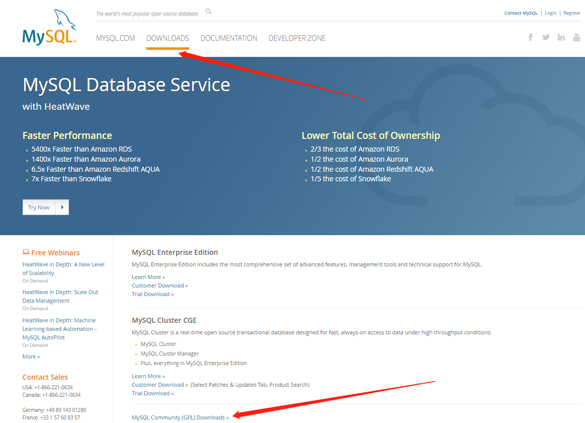
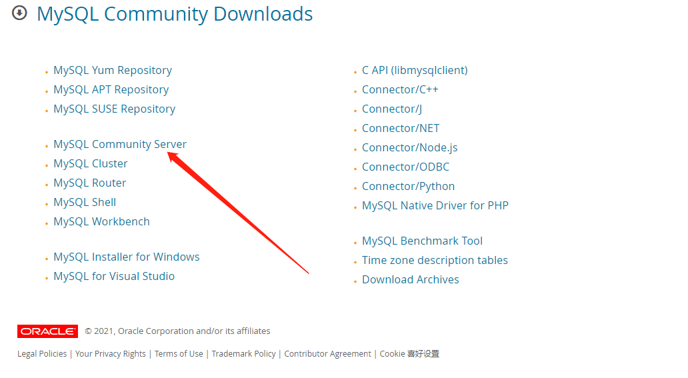
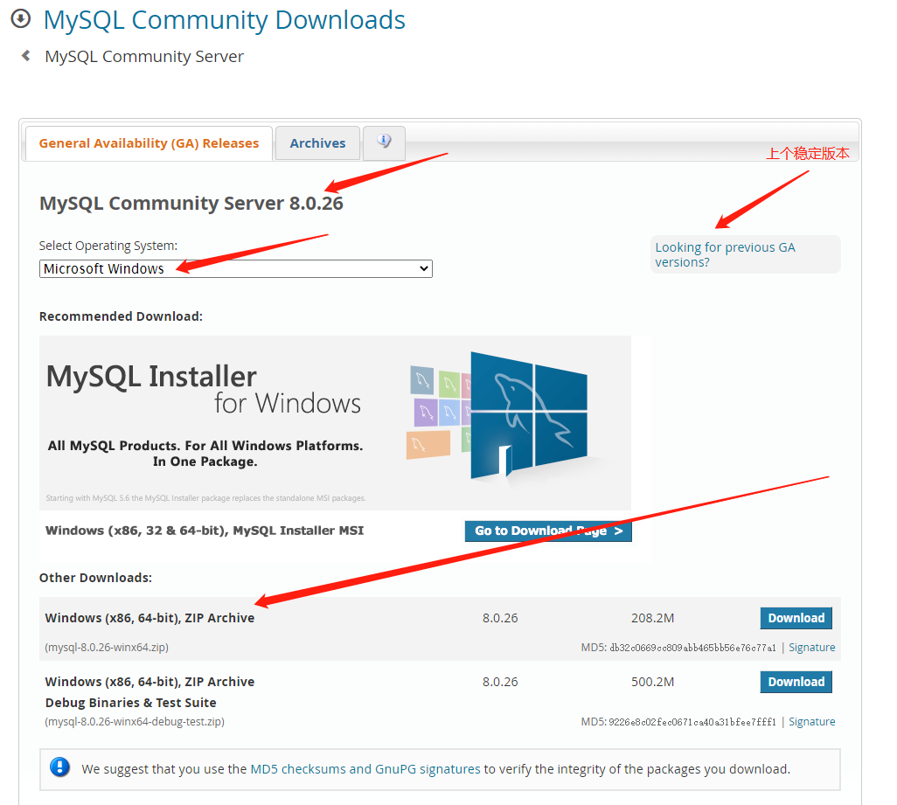
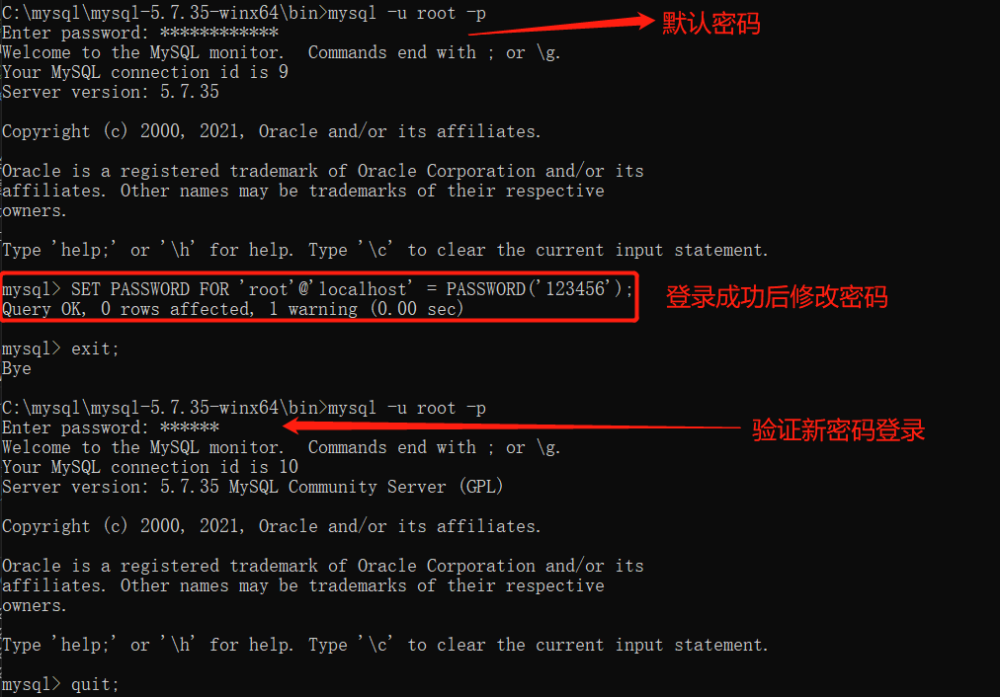

## 初识mysql
> 关系型数据库

### 环境搭建

#### 安装 -> 仅介绍'解压缩'方式，官方过去支持'安装包、解压缩'两种方式，目前仅支持'解压缩'方式
> 1. 下载：
> https://www.mysql.com/downloads/ -> 最新版8.0.26，稳定版5.7.xx，建议使用次顶配的稳定版5.7.xx



> 2. 解压缩：C:\mysql目录下进行解压缩
> 3. 添加数据库存放数据目录：手动创建data目录 -> 后续如果启用服务失败，5.7+需要初始化data目录，进到bin目录后执行mysqld --initialize-insecure
> 4. 添加数据库配置文件my.ini：需修改mysql安装目录、数据存放目录，根据下载位置决定
```ini
[client]
# 设置mysql客户端默认字符集
default-character-set=utf8
 
[mysqld]
# 设置3306端口
port = 3306
# 设置mysql的安装目录
basedir=C:\\mysql\\mysql-5.7.35-winx64
# 设置mysql数据库的数据存放目录，MySQL 8+ 无需该配置，系统生成即可，否则有可能报错
# datadir=C:\\mysql\\mysql-5.7.35-winx64\\data
# 允许最大连接数
max_connections=200
# 服务端使用的字符集默认为8比特编码的latin1字符集
character-set-server=utf8
# 创建新表时将使用的默认存储引擎
default-storage-engine=INNODB
```
> 5. 初始化：
>       [1].打开CMD命令行 -> 管理员身份运行[必须]
>       [2].进到bin目录：C:\mysql\mysql-5.7.35-winx64\bin
>       [3].执行mysqld --initialize --console -> 会生成mysql登录密码，后续登录需使用
> 6. 安装：mysqld install
> 7. 启动/关闭服务：
>       [1].命令行操作：CMD命令行执行net start mysql、net stop mysql
>       [2].图形化操作：win+R后输入services.msc,找到mysql服务启动关闭
> 8. 使用服务：
>       需要登录：mysql -u root -p;//输入密码即可，默认登录密码是串乱码，就是第5步初始化阶段生成的密码，登录成功后可修改set password for 'root'@'localhost' = password('xxxxxx'); SET PASSWORD FOR 'root'@'localhost' = PASSWORD('123456');//大小写均可

#### 卸载
> 1. 直接卸载mysql软件[其是数据库管理系统，但依旧是软件]
> 2. 删除注册表：mysql安装目录、mysql数据存放目录
> -> 若再次安装mysql失败[某些时候需更新mysql版本]，大多数情况都是'注册表'未删除