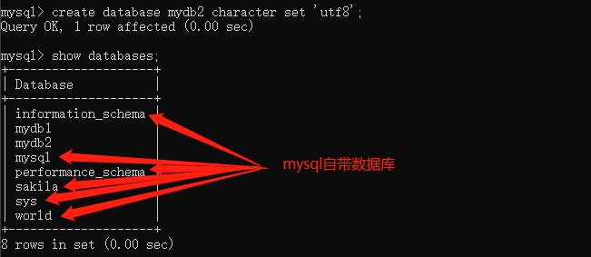

## 数据库、表操作
> 基于CMD的操作方式：
> 1. 打开mysql的安装目录bin文件夹：cd C:\mysql\mysql-5.7.35-winx64\bin
> 2. 登录：mysql -u root -p;//输入密码登录
> 3. 输入sql语句操作即可：例如create database name; -> 语句结尾必须添加分号，其会返回结果[语句结尾必须添加分号来表示语句的结束，mysql是非过程性语言(不依赖其它语句，一条语句返回一个结果)]
> -> 结束的时候输入exit;[必须添加分号]

### 数据库操作
> 创建
> create database name;//基本写法
> create database name character set 编码 collate 校对规则;//完整写法 -> 开发中直接使用基本语法即可，存在默认值

> 查看
> show databases;//查看所有库
> use name;//切换数据库
> show create database name;//查看当前数据库的创建信息
> select database();//查询当前正在使用的数据库


> 修改
> alter database name character set 'gbk' collate '校对规则';//仅能修改编码及校对规则 -> 很少使用

> 删除
> drop database name;//数据库中的表、数据均会被删除

### 表操作
> 创建
```sql
create table 表名 (
  字段1 类型(长度) 约束,
  字段2 类型(长度) 约束,
  字段3 类型(长度) 约束
);//最后一个字段不能使用逗号、字符串类型长度不能省略，其它类型可省略(使用默认值)

类型：
1.数值型：tinyint、smallint、int、bigint、float、double
2.字符串类型：varchar[长度可变,例如varchar(10),存入数据hello,那么最终长度就是5]、char[长度不可变,char(10),存入数据hello,用空格补全剩余位置]
3.大数据类型：blob[基于字节传输、视频]、text[基于字符传输、文本]
4.逻辑类型：bit[java中是true或false、数据库中是1或0]
5.日期类型：date[仅包含日期，年月日]、time[仅包含时间，时分秒]、datetime[包含日期时间,若插入数据的时候，字符值为空，字段的值就是空]、timestamp[包含日期和时间，若插入数据的时候，设置字段的值为空，默认获取当前系统时间作为字段值]

约束：保证数据的完整性
1.主键约束：唯一标识[primary key 声明该列为主键]
2.唯一约束：声明字段值为唯一[unique]
3.非空约束：声明字段值不能为空[not null]

create table employee (
  id int,
  name varchar(30),
  gender char(5),
  birthday date,
  entry_date date,
  job varchar(50),
  salary double,
  resume text
)
```

> 查看
> show tables;//xx库所有表
> desc 表名;//查询表信息
> show create table 表名;//查看表创建信息
> -> use xx;//其没有该语句，修改语句都是直接指定'表名称'操作的，并非'use xx，先找到表，再执行sql; 修改语句直接放到了一起'

> 修改 -> 操作较多，插入数据、某数据的字段等
> rename table oldName to newName;//修改表名称
> alter table 表名称 add 字段名 数据类型(长度) 约束;//添加新字段
> alter table 表名称 modify 字段名 数据类型(长度) 约束;//修改字段的数据类型、长度或约束
> alter table 表名称 drop 字段名;//删除某字段
> alter table 表名称 change 旧字段 新字段 数据类型(长度) 约束;//修改字段名称

> 删除
> drop table 表名称;