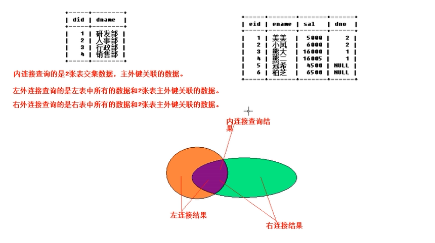

## 多表查询 -> 仅解决'一对多、多对多表关系'
> 背景：之前都是基于单表查询，sql提供了多表查询方式 -> 实际就是根据查询条件'基于单表组合成新表'然后返回该表即可

> 笛卡尔积：
> select * from 表A,表B;//两张表结果的乘积 -> 必然会出现问题，没实现去重，因此依旧需要'多表查询'的方式

### 内链接查询 -> 查询两张表交集数据，实际就是主外键关联数据
> 普通内链接
> select * from 表1 inner join 表2 on 条件
> select * from dept inner join emp on dept.did = emp.dno;

> 隐式内链接 -> 使用较多
> select * from 表1,表2 where 表1.字段 = 表2.字段
> select * from dept,emp where dept.did = emp.dno;
> select * from dept d, emp e where d.did = e.dno;//别名
> select d.dname,e.ename from dept d,emp e where d.did = e.dno;//指定字段查询

### 外链接查询
> 左外链接/左链接 -> 先把左表数据全部查询出来，再查询主外键关联数据
> select * from 表1 left outer join 表2 on 表1.字段 = 表2.字段;//outer可省略
> select * from dept left outer join emp on dept.did = emp.dno;

> 右外链接/右链接 -> 先把右表数据全部查询出来，再查询主外键关联数据
> select * from 表1 right outer join 表2 on 表1.字段 = 表2.字段;//outer可省略
> select * from dept right outer join emp on dept.did = emp.dno;

### 内链接查询 VS 外链接查询
> 若数据正常，两者查询结果必然相同; 若数据异常[某表中部分数据进行了主外键关联，部分数据并未进行关联]，查询结果就有区别，需根据业务要求进行调整


```sql
// 部门
create table dept(
  did int primary key auto_increment,
  dname varchar(30)
);

// 员工
create table emp(
  eid int primary key auto_increment,
  ename varchar(30),
  sal dobule,
  dno int,
  foreign key (dno) references dept (did) // 外键
);

insert into dept values(1,'研发部');
insert into dept values(null,'运营部');// 自动递增

insert into emp values(1,'a',1.5,1);
insert into emp values(2,'b',1.5,1;
insert into emp values(3,'c',1.5,2);
insert into emp values(4,'d',1.5,2);

// 笛卡尔积：两张表结果的乘积
select * from dept,emp;//8个结果 -> 必然会出现问题，1个人不能属于两个部门，没去重，因此需使用'多表查询方式'

// 内链接查询
select * from dept inner join emp on did = dno;
select * from dept,emp where did = dno;
select * from dept d, emp e where d.did = e.dno;// 取别名
slect d.dname,e.ename from dept d, emp e where d.did = e.dno;// 查询关键字

// 外链接查询
select * from dept d left outer join emp e on d.did = e.dno;
select * from dept d right outer join emp e on d.did = e.dno;
```

### 子查询 -> 嵌套查询
> 多个select语句嵌套才能查询出结果
> select username,english from stu where english > (select avg(english) from stu);// 查询英语成绩大于平均分的同学