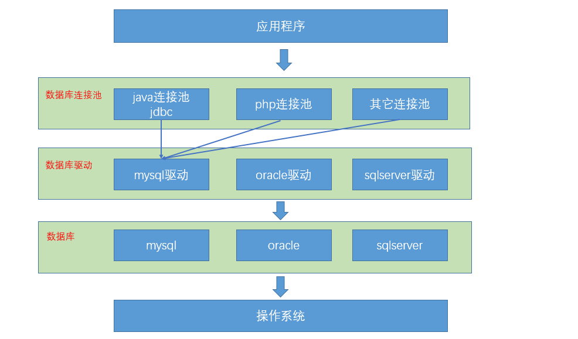
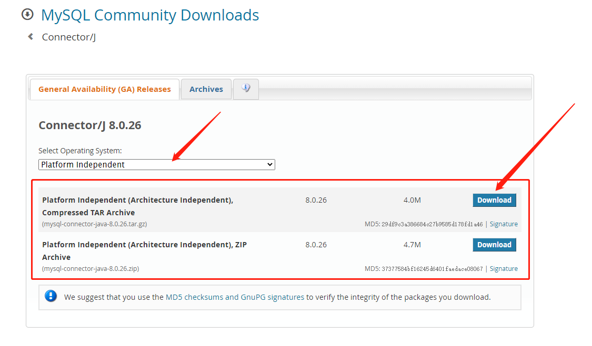

## jdbc -> 数据库连接池
> 背景：SUN公司提供了JAVA操作数据库规范，也就是JDBC，这些规范由具体厂商实现
> 其作为应用程序与数据库的'连接媒介'，需要满足所有的sql操作，也就是根据sql完成对数据的操作

> 需要的包：
> 1. java.sql
> 2. javax.sql
> 3. 数据库驱动包 -> 官方下载即可https://dev.mysql.com/downloads/connector/j/
